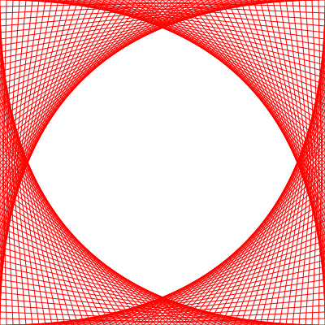
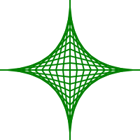
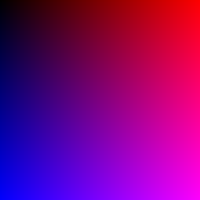
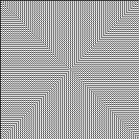
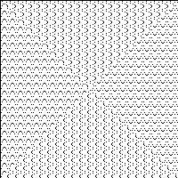
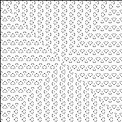
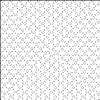

# Hratky s cisly

- Numbers 7560 and 9250 have most dividers, 64 of them
- 200 numbers
- Number 6171 need maximum number of steps 261
- 49061
- 1594323

# Prace s grafikou

# Ulamova spirala

Normal ulam

Ulam dividers by 3

Ulam dividers by 5

Ulam dividers by 7

Ulam dividers by 9

Ulam dividers by 10

Ulam dividers by 11

Ulam dividers by 13

Ulam dividers by 17

Ulam dividers by 18

