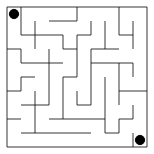
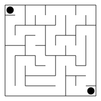
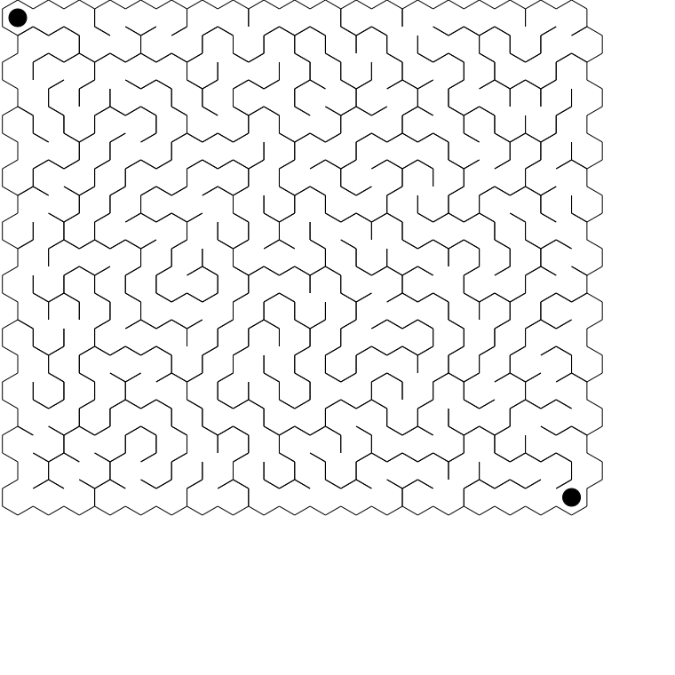

# Generovanie bludisk

## Stvorcove

## Sestuholnikove

### Indexovanie

Normalne dvojrozmerne pole, ktore je dvakrat sirsie ako dlhsie

| 1 |   | 2 |   | 3 |   |
|---|---|---|---|---|---|
|   | 4 |   | 5 |   | 6 |
| 7 |   | 8 |   | 9 |   |

### Susedia

Vrchol 5 ma za susedov vrcholy - 2,4,8,9,6,3

Sestuholniky su na vysku

- 2,3 - su horni sikmi susedia
- 4,6 - su bocny susedia
- 8,9 - su spodni sikmi susedia

## Poznamky

- stvorcove si davam najskor do textovej podoby a tak ho vykreslujem do svg
- sestuholnikove som chcel robit podobne, ale vela zbytocneho casu som stravil nad vymyslanim textovej reprezentacie, tak to nakoniec vykreslujem rovno po skonceni dfs, neprevadzam na text
- obe generovania pracuju nahodnostne
- podla mna zlozitost bludiska zavysi aj od algoritmu, pretoze dfs robi jendu dlhu cestu, ktoru je lahke nasledovat, velke bludisko vyzera zlozito, najme to sestuholnikove, ale vacsinou bolo jendoduche sa dostat do ciela
