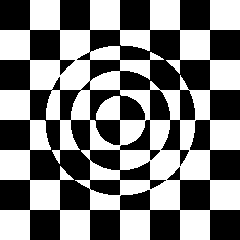
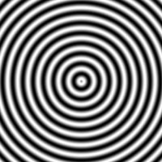

# Zakladni utvary

# Vypln mnohouholnika

## Explanation

Vela pokusov kym sa mi to podarilo sfinalizovat, oznaceny kod sa nepouziva, no nemazal som ho.

Posledna funkcia je funkcna.

Ked je priamka vodorovna, tak len kontrolujem, ci sa bod nachadza na priamke, ak ano vyfarbim na cierno, ak nie pokracujem s dalsimi praimkami bez dalsieho spracovania tejto usecky.

Dalej je tam magicky riadok s poznamkou explanation in readme. Snazim sa pomcoou parametrickeho vyjadrenia dvoch useciek najst ich prienik.

x,y - suradnice bodu

Ax,Ay - suradnice bodu A, a[0],a[1]
Vx,Vy - smerovy vektor usecky, vector[0], vector[1]

Parametricke vyjadrenie usecky y = 0
X = x - 1*s
Y = y + 0*s

Parametricke vyjadrenie usecky line
X = Ax + Vx*t
Y = Ay + Vy*t

dosadim

x - s = Ax + Vy*t
y = Ay + Vy*t

z druhej vyjadrim t a dostanem

x - s = Ax + Vx * (y - Ay)/Vy

na tom magickom riadku si vypocitam s a porovnam s x, ci priesecnik lezi na usecke.

# Efekty

Chessboard borders

Chessboard sin

Sincut

Sin wave

Colors

