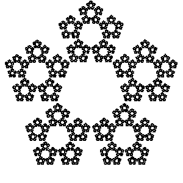
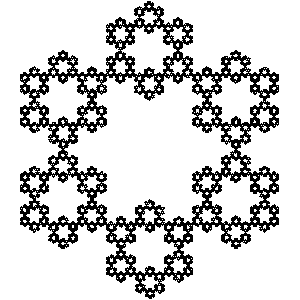
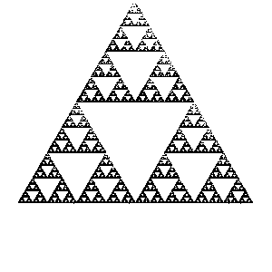
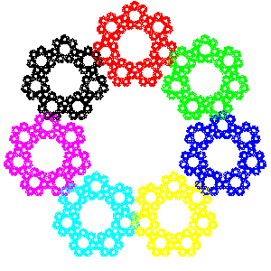
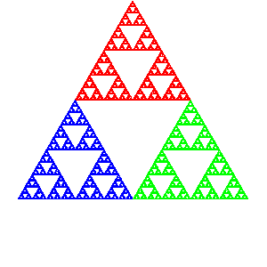
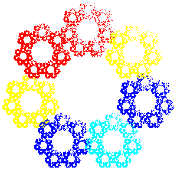

Sierpinsky triangle n = 3, r = 1/2

Pentagon n = 5, r = 1/3

Pentagon n = 5, r = 3/8

Hexagon n = 6, r = 1/3

Septagon n = 6, r = 1/3

Weighted sierpinsky n = 3, r = 1/2, weighted = True

Weighted pentagon n = 5, r = 1/3, weighted = True

Colors

Mix

