# Chaos game

Sierpinsky triangle n = 3, r = 1/2

Pentagon n = 5, r = 1/3

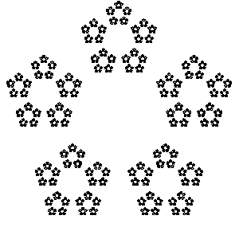

Pentagon n = 5, r = 3/8

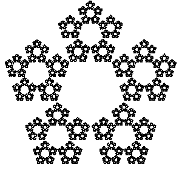

Hexagon n = 6, r = 1/3

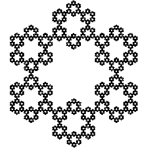

Septagon n = 6, r = 1/3

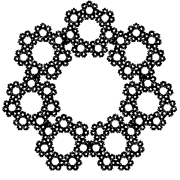

Weighted sierpinsky n = 3, r = 1/2, weighted = True

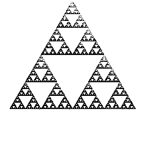

Weighted pentagon n = 5, r = 1/3, weighted = True

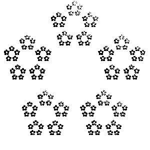

Colors

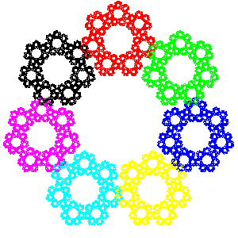

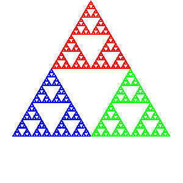

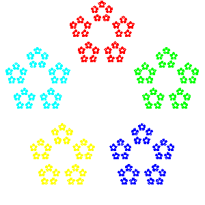

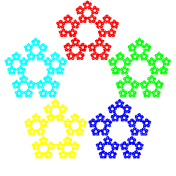

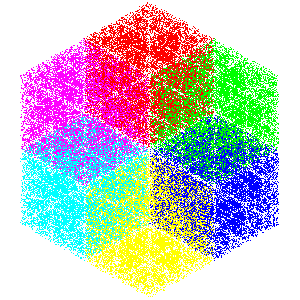

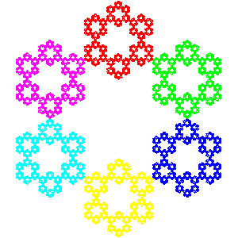

Mix

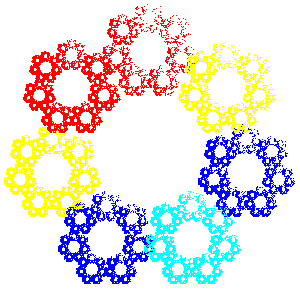

# Feigenbaumuv diagram

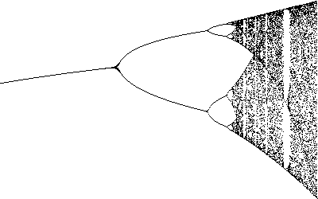

zoom

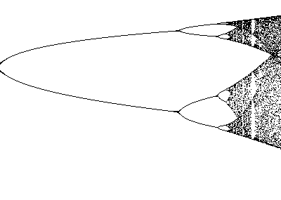

# L systemy

Bush

Dragoncurve

Hilbert 91 degrees

.

.

.

.

.

Hilbert

.

.

.

.

.

Koch

Sierpinski

Tree random

Tree 1

Tree 2

