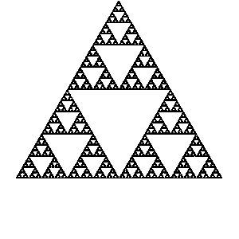

# Chaos game

Sierpinsky triangle n = 3, r = 1/2

Pentagon n = 5, r = 1/3

Pentagon n = 5, r = 3/8

Hexagon n = 6, r = 1/3

Septagon n = 6, r = 1/3

Weighted sierpinsky n = 3, r = 1/2, weighted = True

Weighted pentagon n = 5, r = 1/3, weighted = True

Colors

Mix

# Feigenbaumuv diagram

zoom

# L systemy

Bush

Dragoncurve

Hilbert 91 degrees

.

.

.

.

.

Hilbert

.

.

.

.

.

Koch

Sierpinski

Tree random

Tree 1

Tree 2

