# Monty hall

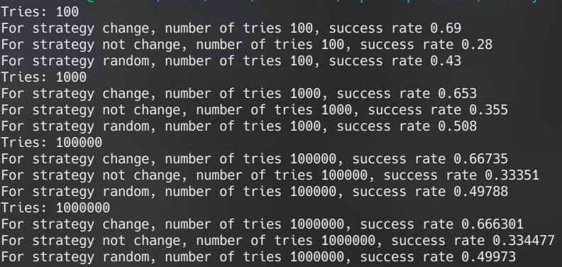

# Nenahodna cisla

Pocetnost:

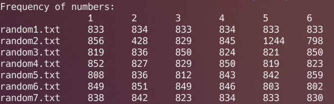

Pre lepsi prehlad, rozdiel od priemeru:

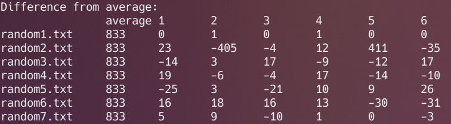

Odtial vidime:

- random 2 - ma velke vykyvy v pocetnosti cisel, malo dvojek a vela patiek
- random 1 - ma zase az presne pocty cisel, vsetky cisla su +- 1 rovnako zastupene

Preto si myslim, ze tieto 2 sekvencie su nenahodne.

Dalej porovnam dvojice dvoch po sebe iducich cisel a ich pocty.

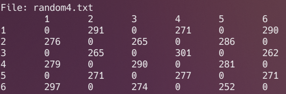

- pre random 4, je vidiet ze niektore dvojice vobec neexistuju, je preto menej moznosti/vyssia pravdepodobnost uhadnut, ake cislo bude nasledovat.
- preto si myslim, ze tato sekvencia je tiez nenahodna

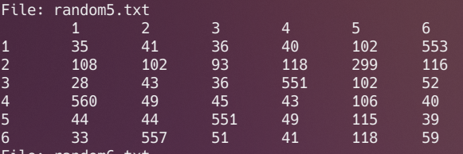

- pre random 5 su niektore dvojice tiez castejsie, opat vyssia pravdepodobnost na uhadnutie dalsieho cisla.
- nenahodne

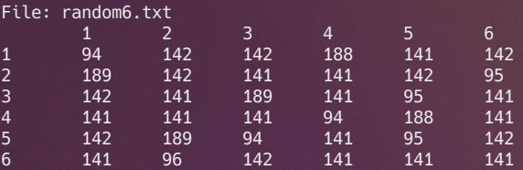

- v random 6 je vacsina dvojic zastupena v priblizne rovnakom pocte, no v kazdom stlpci/riadku sa nachadza dvojica/dvojice s vyrazne nizsou a vyssou pocetnostou
- tiez to zavana nenahodnostou
  
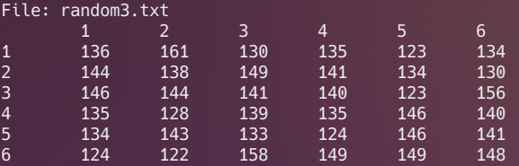
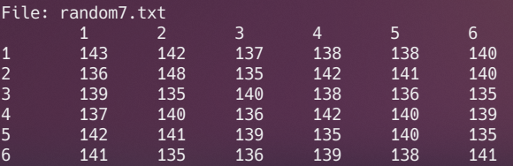

- pre random 3 a random 7 su uz dvojice v priblizne rovnakom pocte, ziadne vacsie vykyvy
- preto by som povedal, ze tieto dve postupnosti by mohli byt nahodnymi

# Centralni limitni veta

- pri metode 1 a 2 to vyzera na priblizne normalnu distribuciu
- pri metode 3 uz nie, velmi caste su 2 hodnoty, priemery kociek

## n = 10

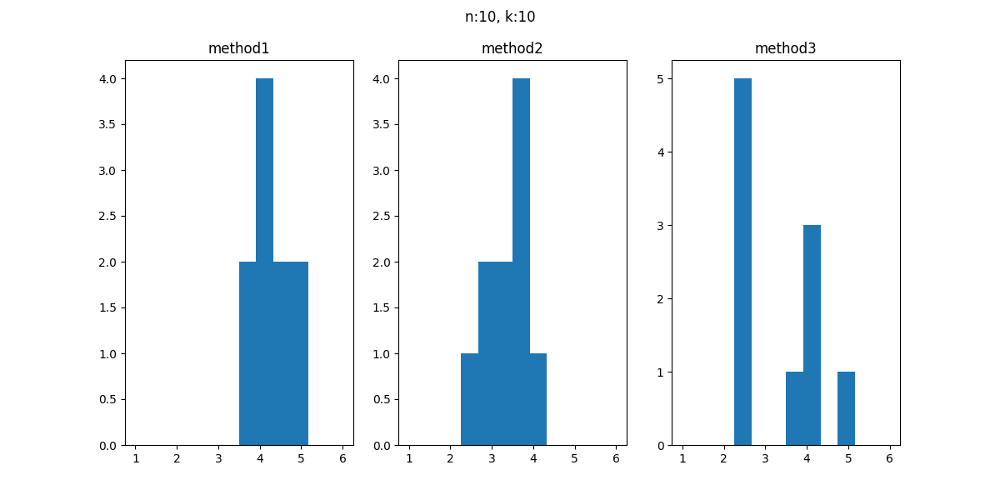

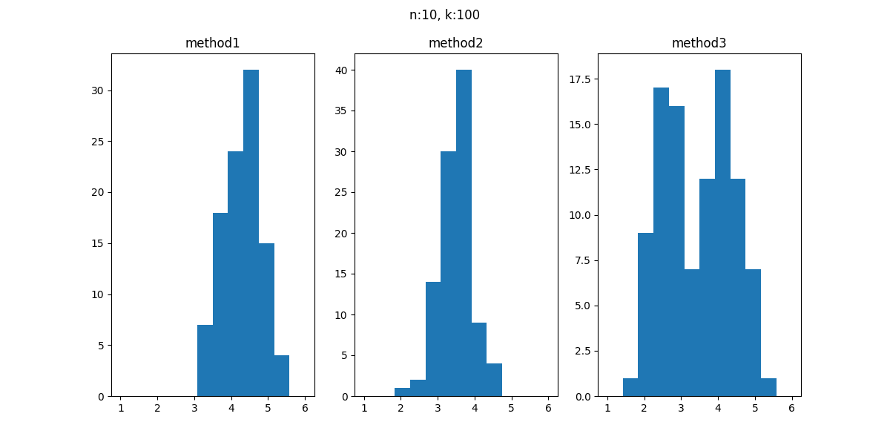

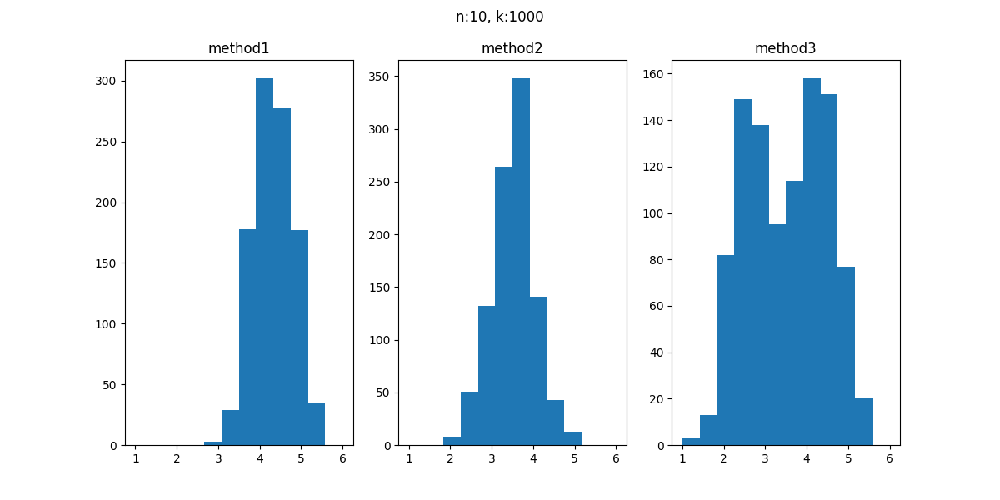

## n = 1000

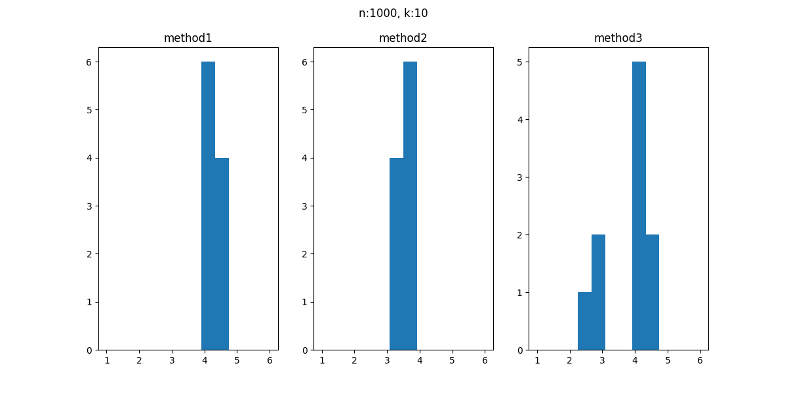

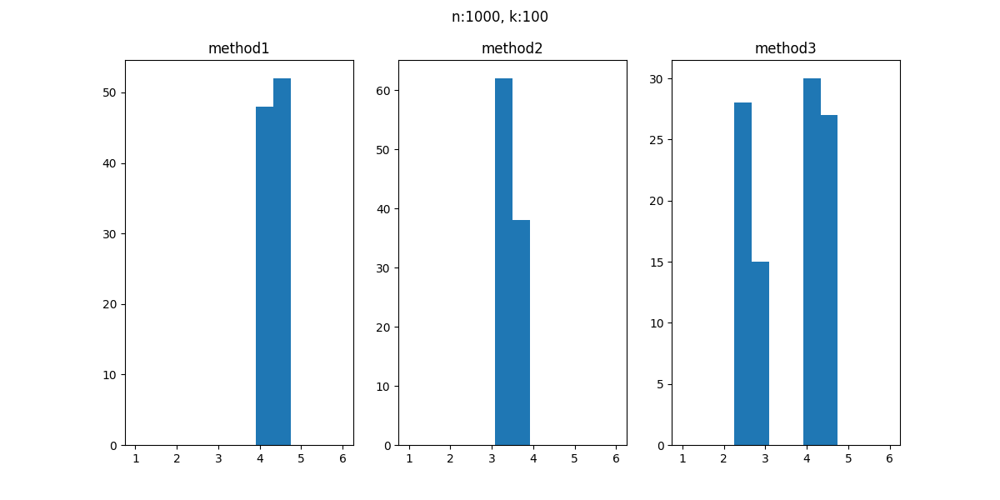

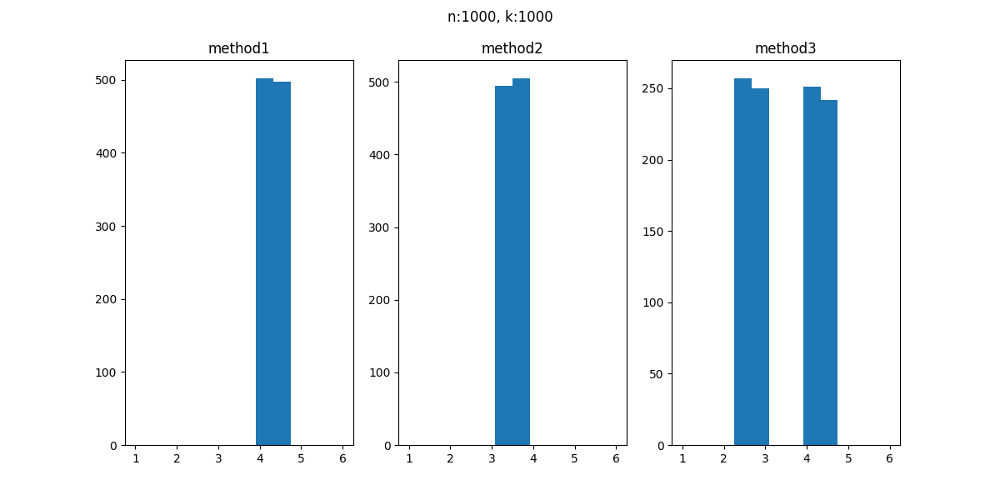

## n = 100000

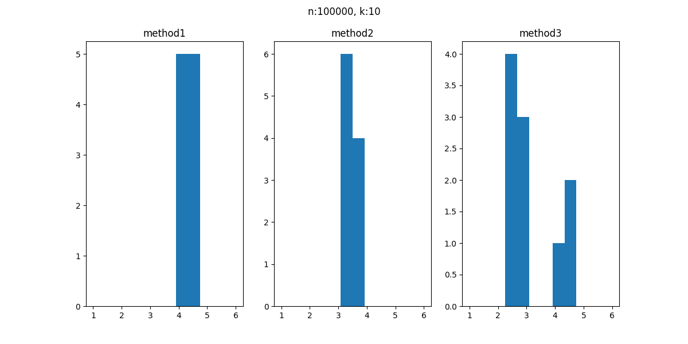

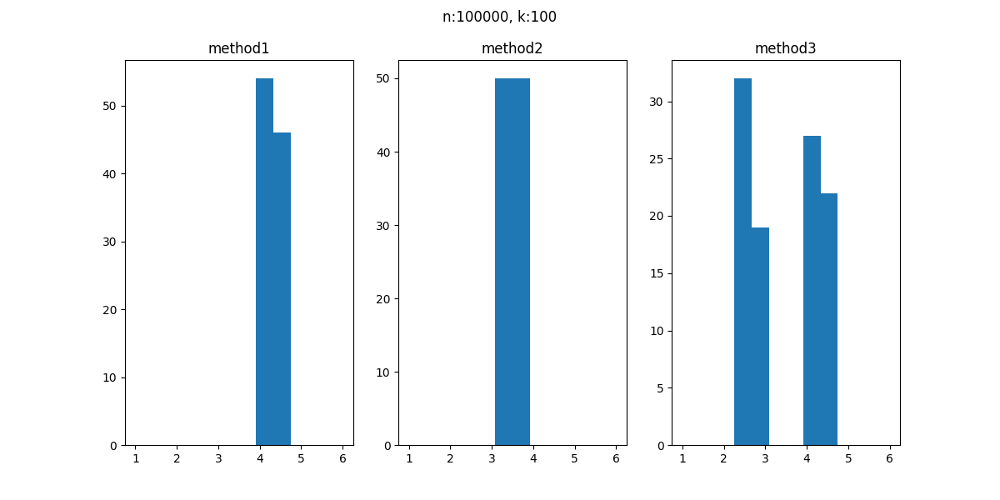

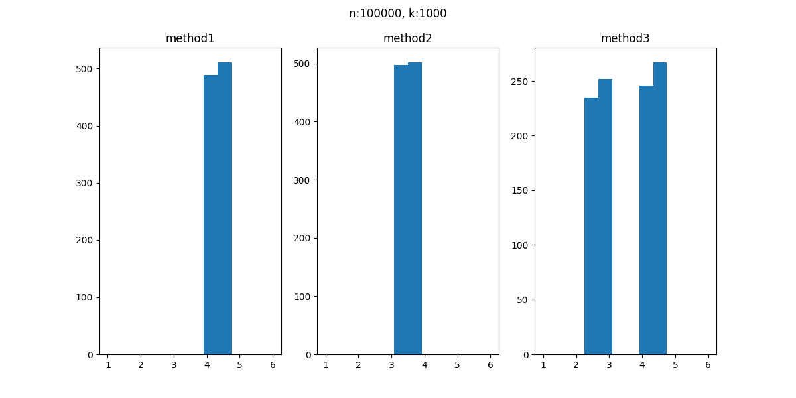

# Bayesova veta

- vypocet je prilozeny v [pdf](9-pravdepodobnost/D-Bayesova-veta/IV122__vypocet_bayesova_veta.pdf)

## n = 10, x = 5

Moj odhad: 0.10

Vypocet: 0.001156

Simulacia: 0.0013

## n = 100, x = 3

Moj odhad: 0.20

Vypocet: 0.3143

Simulacia: 0.31344

## n = 1000, x = 5

Moj odhad: 0.10

Vypocet: 0.1138

Simulacia: 0.1108